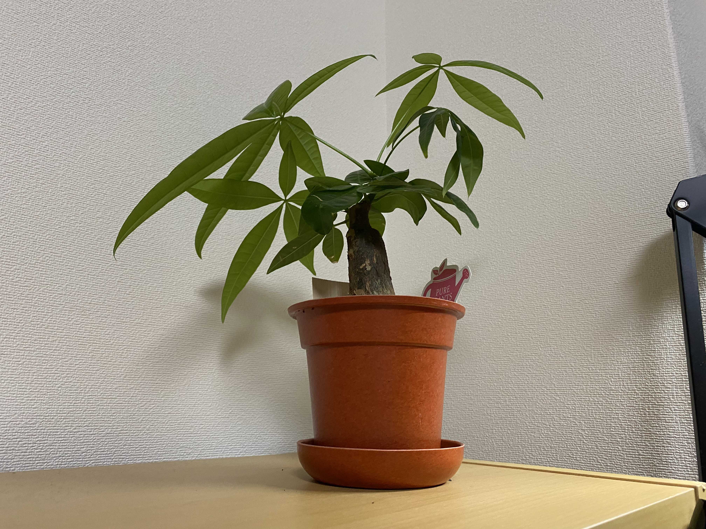
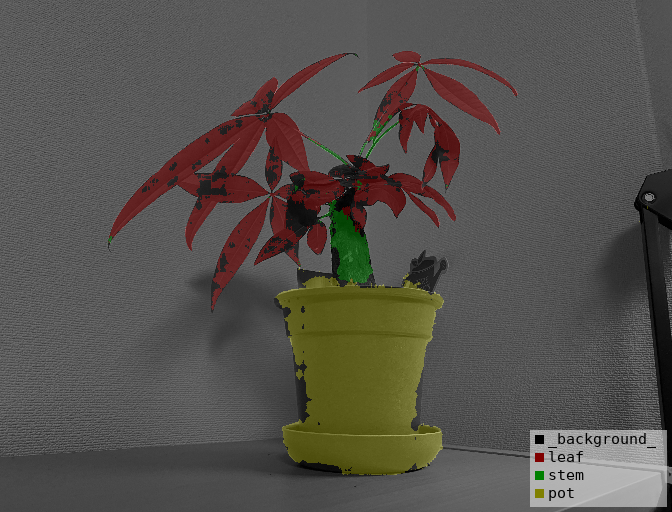

# plant-record
植物の成長記録を全自動で行おう。成長差分の認識もしたいな。成長の統計の可視化もしたいな。目指せ publish

## Environment

### jetson nano
- JetPack 4.5
- USB Web Camera (RasberryPi Camera Moduleは画質、色彩が悪かった)
- cron
    - 定期実行処理のため

- Docker [jetson tensorflow image](https://ngc.nvidia.com/catalog/containers/nvidia:l4t-tensorflow) (Ubuntu 18.04.5 LTS)
    - python 3.6.9
        - opencv-python
        - tensorflow == 2.3.1 (l4t-tensorflow:r32.5.0-tf2.3-py3)
        - tensorflow-examples
        - requests (api用)
        - requests-oauthlib (api用)
        - labelme (アノテーション用, 結果可視化用)

## Demo 
現状: jetson nano, develop ブランチ上にて

- リポジトリをクローン, developブランチに切り替え
```bash
$ git clone git@github.com:junprog/plant-record.git
$ cd plant-record
$ git featch
$ git checkout -b develop origin/develop
```

- コンテナ立ち上げ
```bash
$ sudo docker build -t plant-record .
... # 時間かかります
$ sudo docker run -it --rm --runtime nvidia --device /dev/video1:/dev/video1:mwr plant-record 
```

- コンテナ内にてテスト
```bash
% python3 test/test_getimage.py

# notify 設定済の場合
% python3 main_flow.py
```

## Features

- [getImage](#getImage)
- [notify](#notify)
- [segmentation](#segmentation)
- [recognizeDiff](#recognizeDiff)
- [GUI](#GUI)

<a id="getImage"></a>

### getImage

1日に1,2枚植物画像を取得する。

- 定期処理  : cron
- 画像取得  : python + opencv-python

<a id="notify"></a>

### notify

取得画像を通知する。

- 通知      : Twitter, Slack + incoming-webhook

```bash
$ sh setup_notify_twitter.sh    # config 作成 → twitter, slackのconfigを各自入力
$ python3 test/test_getimage.py # 写真撮影テスト
$ python3 test/test_notify.py   # 通知テスト (撮影した画像パスを入力)
```

<a id="segmentation"></a>

### segmentation

植物の写真 -> segmentation model -> segmentation mask [葉, 枝, 鉢, 背景] のセグメンテーションを行う。

- データセット: 画像を各自で用意、各自でアノテーション

- ground truth 生成: generate_mask.py
	- ground truthのpngファイル作成

```bash
$ python dataset/generate_mask.py [data directory] --labels dataset/labels.txt   
```

- 実行後の [data directory] ディレクトリ構造:

```
[data directory]
    ├　class_names.txt
    ├　*.jpg
    ├　*.png
    └  SegmentationClassVisualization (optionで作成するかどうか指定可能)
        └  *_vis.jpg
```

- 学習: 
    - 学習コマンド

```bash
$ python3 segmentation/train_unet.py --data-dir [data directory] --result-dir [result-dir] --gpu
```

- 予測:
    - 予測コマンド

```bash
$ python3 test/test_predict.py --image-path [image file path] --weight-path [weight file path]
```

| 入力画像 | 予測結果 |
|---|---|
|  |  |


<a id="recognizeDiff"></a>

### recognizeDiff

随時更新

<a id="GUI"></a>

### GUI

随時更新
